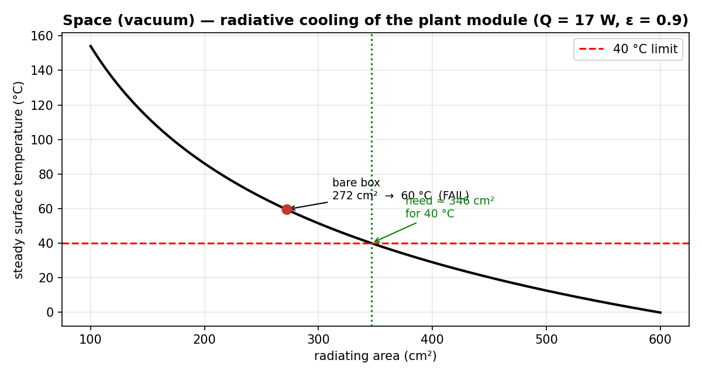

# Space-Environment Variant (Bonus) — Vacuum Thermal Analysis

A re-analysis of the same payload pod (17 W dissipation, 40 °C limit) for operation
inside a satellite, where the surroundings are a **vacuum**. This is an analytical
(theoretical) study — no prototype and no CFD, because in vacuum there is no fluid to
simulate.

## Why the strategy must change

Heat leaves a body by three mechanisms:

| Mechanism | In air (atmospheric design) | In vacuum (space) |
|---|---|---|
| Convection (incl. the fan) | dominant cooling path | **gone** — no fluid to carry heat |
| Conduction | minor | still works (through solids) |
| Radiation | minor | **the only path to the environment** |

So the fan + vents become useless, and the only way to reject heat to space is **thermal
radiation** from a high-emissivity surface (a *radiator*), fed by **conduction** from the
components.

## Governing equation

Steady-state radiation balance (Stefan–Boltzmann):

```
Q = eps * sigma * A * (Ts^4 - Tsink^4)
```

- `Q` = 17 W (dissipation)   · `eps` = 0.90 (high-emissivity coating)
- `sigma` = 5.67e-8 W/m²K⁴   · `Ts` = surface temperature (K)
- `Tsink` ≈ 0 K (deep space, idealized)   · `A` = radiating area

## Results

**Bare enclosure** (external area ≈ 0.027 m²):
```
Ts = (Q / (eps*sigma*A))^(1/4) ≈ 333 K ≈ 60 °C   ->  FAIL
```
The bare box cannot reject 17 W at ≤ 40 °C by radiation alone.

**Required radiator area** (set Ts = 40 °C = 313 K):
```
A = Q / (eps*sigma*Ts^4) ≈ 0.035 m²  (~346 cm²)
```
The box gives ~0.027 m², so adding a small **~9 × 9 cm high-emissivity radiator panel**
holds the module at the 40 °C limit (~0.037 m² for a 35 °C margin).



## Resulting design

- Replace the fan and vents with a **black-anodized / high-emissivity radiator panel facing
  deep space**.
- Add **conductive straps / thermal pads** from each heat source to the radiator — in vacuum,
  heat must reach the radiator by conduction, not convection (the opposite of the atmospheric
  design, where the walls were thermally unimportant).
- Orient the radiator toward cold space, not the Sun or a warm satellite wall.

## Assumptions / limitations

- Deep-space sink (Tsink ≈ 0). A real orbit also sees Earth IR, albedo and sunlight, so the
  effective sink is warmer (~150–250 K) and the required area would grow — note this if quoting.
- Steady state, single lumped surface temperature, eps = 0.90 achievable with coating.
- Internal component-to-radiator conduction is treated qualitatively (a full design would size
  the heat straps / use an FEA conduction–radiation model).

Reproduce the numbers and figure with `python radiator_sizing.py`.
